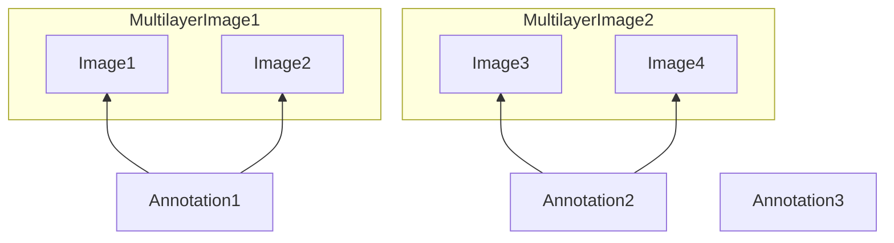

# Generate Multilayer Images

This is otherwise called "overlays", when multiple images represent different views of the same object.

## Preferred method

To indicate that multiple images are a single object and thus an annotation should apply to all of the single images, you should use the `MultilayerImage` class which is the correct representation.

An example is described in [generate_overlays_multilayer.py](generate_overlays_multilayer.py)

The `MultilayerImage` should hold the metadata common to all images.

## Legacy method

***This method should NOT be used, as it breaks unicity of the Image ids***

An alternative which was used before the MultiLayerImage class was introduced in version 1.0 consisted of assigning the same `id` to multiple images thus saying "these should be considered as one entity". This was a workaround for a specific use case and should not be used anymore yet it is covered in the [generate_overlays.py](generate_overlays.py) and [generate_overlays_classes.py](generate_overlays_classes.py) files.
