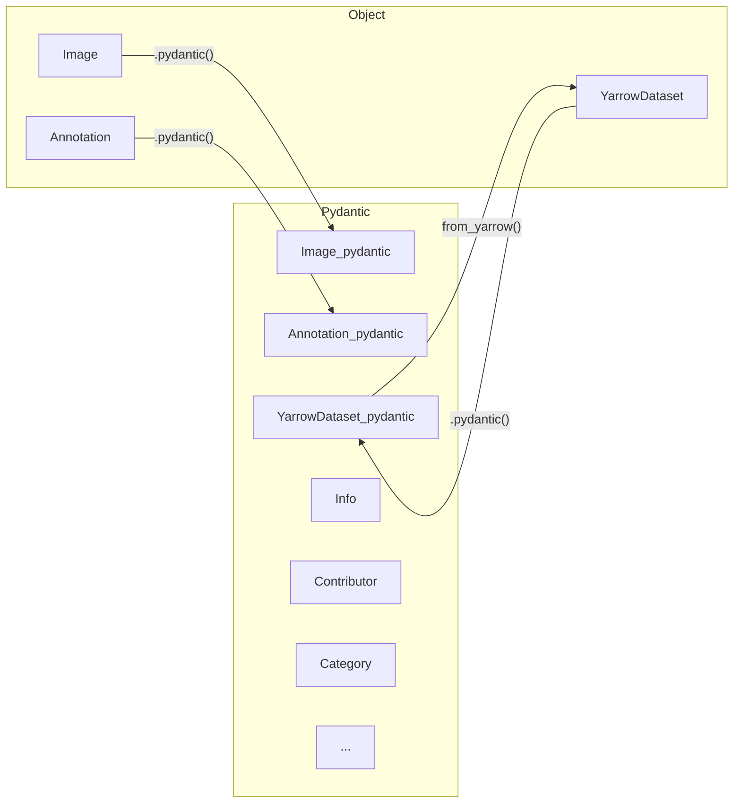

# Object Classes

To follow the yarrow scheme we historically used pydantic classes but had to handle links between objects manually, this implied doing searchs which were tiresome and inneficient.

## Big picture

To improve the developper experience we created 3 additional classes that do not inherit from `BaseModel` of `pydantic` but are simple `object` classes. These are not directly serializable but handle the links directly. Yet you must use the `pydantic` classes such as `Info` when creating a `YarrowDataset`



## Image class

```python
from yarrow import Image
from datetime import datetime

img = Image(
    width=300,
    height=200,
    file_name="path/to/image.jpeg",
    date_captured=datetime.now(),
    azure_url="http://<online_storage>/path/to/image.jpeg",
)

img_pydantic = Image.pydantic()

# Now img_pydantic is a valid pydantic object will can be used to serialize the object

img_dict = img_pydantic.dict()
```

## Annotation class

```python
from datetime import datetime
from yarrow import Image, Annotation, Contributor, Category

img = Image(
    width=300,
    height=200,
    file_name="path/to/image.jpeg",
    date_captured=datetime.now(),
    azure_url="http://<online_storage>/path/to/image.jpeg",
)

contrib = Contributor(
    human=True,
    name="labeler"
)

categ = Category(
    name="CQ",
    super_category="CQ",
    value="15.1"
)

annot = Annotation(
    contributor=contrib,
    name="bump",
    images=[img],
    categories=[categ],
    bbox=[50,50,75,75],
    date_captured=datetime.now(),
)

assert isinstance(annot.images[0], Image) # Iterating over image will directly return image objects

annot_pydantic = annot.pydantic() # This is a annotation_pydantic instance

assert annot_pydantic.image_id[0] == annot.images[0].id
assert annot_pydantic.category_id[0] == annot.categories[0].id
```

## YarrowDataset class

```python
from datetime import datetime
from yarrow import Image, Annotation, Contributor, Category, YarrowDataset

img = Image(
    width=300,
    height=200,
    file_name="path/to/image.jpeg",
    date_captured=datetime.now(),
    azure_url="http://<online_storage>/path/to/image.jpeg",
)

contrib = Contributor(
    human=True,
    name="labeler"
)

categ = Category(
    name="CQ",
    super_category="CQ",
    value="15.1"
)

annot = Annotation(
    contributor=contrib,
    name="bump",
    images=[img],
    categories=[categ],
    bbox=[50,50,75,75],
    date_captured=datetime.now(),
)

yar_set = YarrowDataset(
    info=Info(source="example", date_created=datetime.now())
)
# You should instantiate the dataset as empty and use the add_*() functions

yar_set.add_annotation(annot)
```

## Convert to pydantic classes and serialize

All previously mentioned classes (Image, Annotation and YarrowDataset) implement a `pydantic()` function which converts them to their corresponding class while handling all the id operations, you should not even have to bother with this step intermediate state and chain directly with `dict()` or `json()`

```python
import json

yar_set_dict = yar_set.pydantic().dict(exclude_none=True)

with open("path/to/file.yarrow.json", "w") as fp:
    json.dump(yar_set_dict, fp, default=str)
```

## Parse a yarrow file directly to a YarrowDataset

The `YarrowDataset` class has utility class functions that mimic pydantic ones such as `parse_file()`, `parse_obj()` or `parse_raw()`

```python
from yarrow import *

yarrow_set = YarrowDataset.parse_file("examples/object_classes/demo.yarrow.json")

assert isinstance(yarrow_set, YarrowDataset)
```
